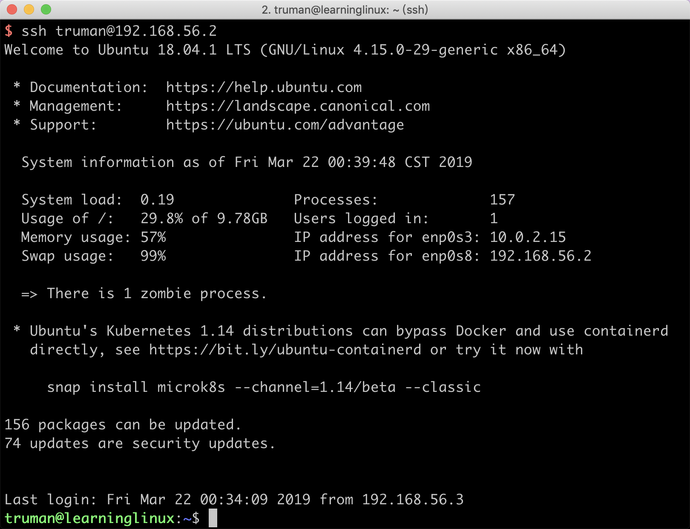
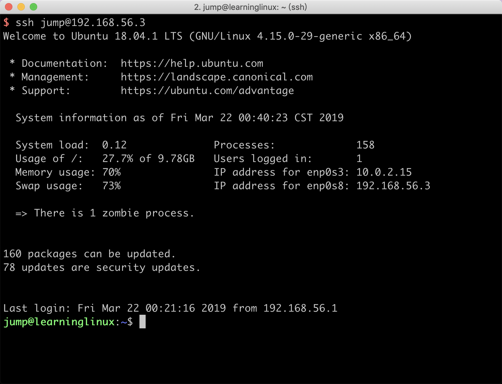
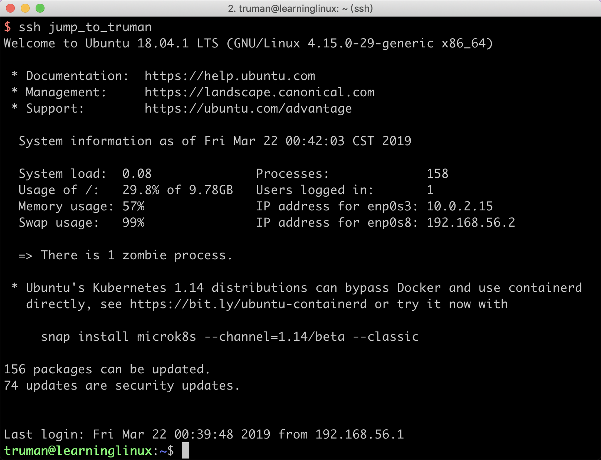
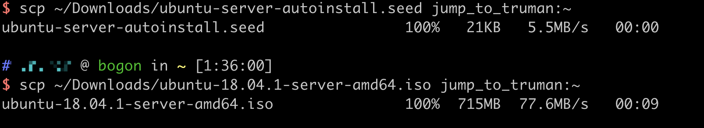
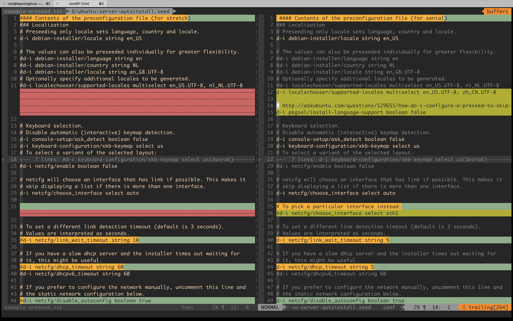

# 无人值守Linux安装

## 实验要求
- 配置无人值守安装iso并完成自动化安装

## 实验环境

- 宿主机 ： MacOS 10.14.3
- 跳板机 jump： ubuntu-18.04.1-server-amd64
- 镜像制作虚拟机 truman： ubuntu-18.04.1-server-amd64


## 实验步骤

### 配置ssh免密登录

两台虚拟机通过`sudo apt install openssh-server`安装openssh-server

配置ssh免密登录

1. 在宿主机通过`ssh-keygen -t rsa`生成密钥对
2. 将生成的公钥通过`ssh-copy-id -i ~/.ssh/id_rsa.pub truman@192.168.56.2`传到truman虚拟机内，这一步需要输入truman的password
3. 成功后，便可以通过`ssh truman@192.168.56.2`直接登录到truman主机上而不需要输入密码
4. 同理，在宿主机上配置到跳板机的免密登录






### 使用SSH ProxyCommand 配置跳板机

修改宿主机的`/etc/ssh/ssh_config`文件，添加

```
Host jump_to_truman
hostname 192.168.56.2
user truman
ProxyCommand ssh jump@192.168.56.3 -W %h:%p
```
执行指令`ssh jump_to_truman`，可以直接通过跳板登录到truman虚拟机



### 制作镜像


因为上一步中已经在`~/.ssh/config`配置了ProxyCommand跳板，所以我们可以直接通过`scp`命令将已经在宿主机上下载好的`ubuntu-server-autoinstall.seed`和`ubuntu-18.04.1-server-amd64.iso`文件传到虚拟机中

```bash
scp ~/Downloads/ubuntu-server-autoinstall.seed jump_to_truman:~
scp ~/Downloads/ubuntu-18.04.1-server-amd64.iso jump_to_truman:~
```



开始制作

```bash
# 将之前传的文件放到/root/底下
sudo cp ~/ubuntu-18.04.1-server-amd64.iso /root
sudo cp ~/ubuntu-server-autoinstall.seed /root/

#以root用户身份
sudo su -

# 创建用于挂载镜像的文件目录
mkdir loopdir

#挂载iso镜像文件到该目录
mount -o loop ubuntu-18.04.1-server-amd64.iso loopdir

# 创建一个工作目录用于克隆光盘内容
mkdir clone_dir

# 同步光盘内容到目标工作目录
# 一定要注意loopdir后的这个/，cd后面不能有/
# -a : --archive archive mode; equals -rlptgoD (no -H,-A,-X) , 表示以递归方式传输文件，并保持所有文件属性
# -v : --verbose increase verbosity 详细模式输出
rsync -av loopdir/ clone_dir

# 卸载iso镜像
umount loopdir

# 进入目标工作目录
cd clone_dir/

# 修改isolinux/txt.cfg，在顶部添加如下菜单项,强制保存退出`:x!`
label autoinstall
  menu label ^Auto Install Ubuntu Server
  kernel /install/vmlinuz
  append  file=/cdrom/preseed/ubuntu-server-autoinstall.seed debian-installer/locale=en_US console-setup/layoutcode=us keyboard-configuration/layoutcode=us console-setup/ask_detect=false localechooser/translation/warn-light=true localechooser/translation/warn-severe=true initrd=/install/initrd.gz root=/dev/ram rw quiet
 
#将ubuntu-server-autoinstall.seed拷贝到~/clone_dir/preseed/目录下
cp ubuntu-server-autoinstall.seed ~/clone_dir/preseed/

# 修改isolinux/isolinux.cfg，timeout改为10
vi isolinux/isolinux.cfg

# 重新生成md5sum.txt
cd ~/clone_dir && find . -type f -print0 | xargs -0 md5sum > md5sum.txt

#系统内没有mkisofs
apt install genisoimage

# 封闭改动后的目录到.iso
mkisofs -r -V "Custom Ubuntu Install CD" \
            -cache-inodes \
            -J -l -b isolinux/isolinux.bin \
            -c isolinux/boot.cat -no-emul-boot \
            -boot-load-size 4 -boot-info-table \
            -o final.iso ~/clone_dir/


```

使用生成的镜像自动安装ubuntu，


## 文件对比

使用`vimdiff`工具可以清楚的查看到两个文件的差异



### 具体差异

1. 修改第11行，改变额外可选的地区和语言，随后增加一行，跳过安装时选择语言
2. 40行到44行：减少linkwait、dhcp等网络配置的等待时间
3. 49行，禁止网络的自动配置
4. 60行到64行，配置网络
5. 76行设置系统的主机名，77行修改域名，dhcp分配到的主机名和域名的优先级将会高于此处
6. 82行强制设置主机名，无视dhcp所分配的主机名
7. 140行和141行设置用户全名和用户名
8. 143行144行设置密码
9. 151行`d-i netcfg/hostname string isc-vm-host`,允许弱密码，避免中间过程没有实现自动化
10. 166行设置时区，169行，安装期间禁止通过NTP server设置时间
11. 178行，如果系统有空间，可以仅对该空间做分区
12. 205行，lvm分区是，逻辑卷的大小为最大
13. 213行，使用multi预定义分区策略，分为/home,/var,/tmp分区
14. 335行，不使用网络镜像
15. 363行，改为server安装包
16. 368行，选择预安装的软件为openssh-server
17. 371行，禁止软件自动升级
18. 379行，自动安全更新软件


## 参考链接

- [SSH Kung Fu](https://blog.tjll.net/ssh-kung-fu/)
- [how do I configure preseed to populate the hostname from DHCP and not stop at the configure the networksection during an unattended installation?](https://askubuntu.com/questions/667515/how-do-i-configure-preseed-to-populate-the-hostname-from-dhcp-and-not-stop-at-th)
- [https://help.ubuntu.com/lts/installation-guide/example-preseed.txt](https://help.ubuntu.com/lts/installation-guide/example-preseed.txt)
- [How do I configure a preseed to skip the language support question?](https://askubuntu.com/questions/129651/how-do-i-configure-a-preseed-to-skip-the-language-support-question)


